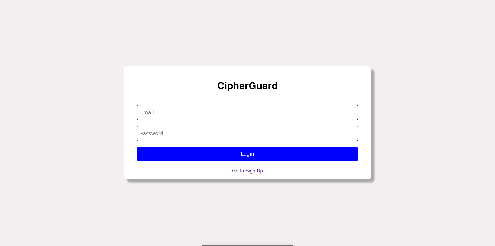
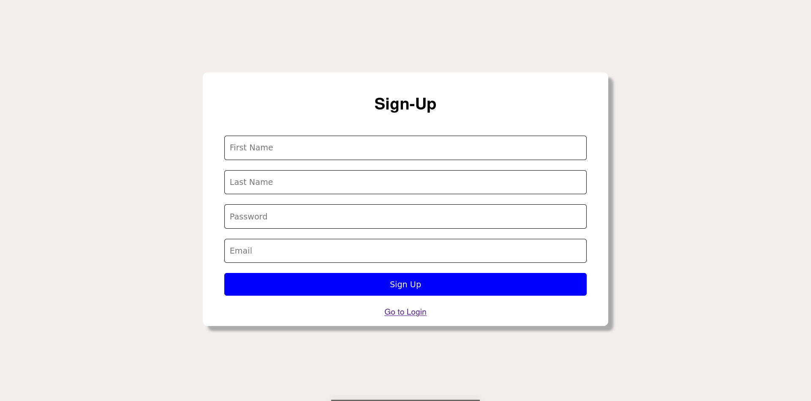
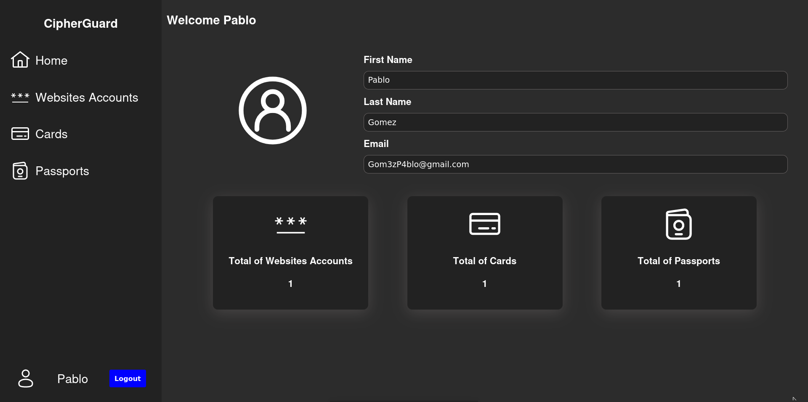
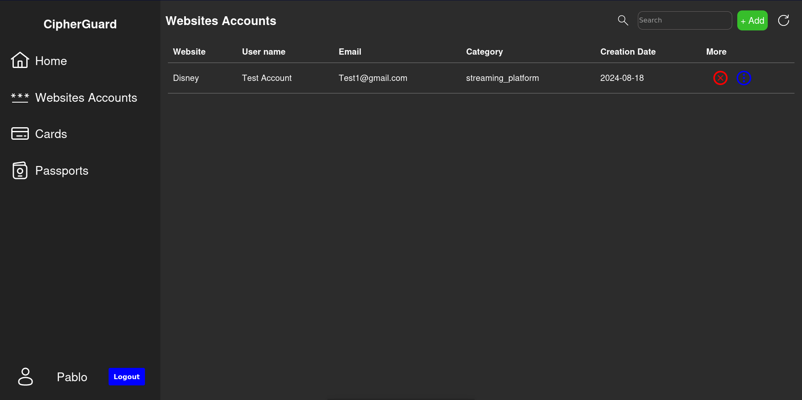
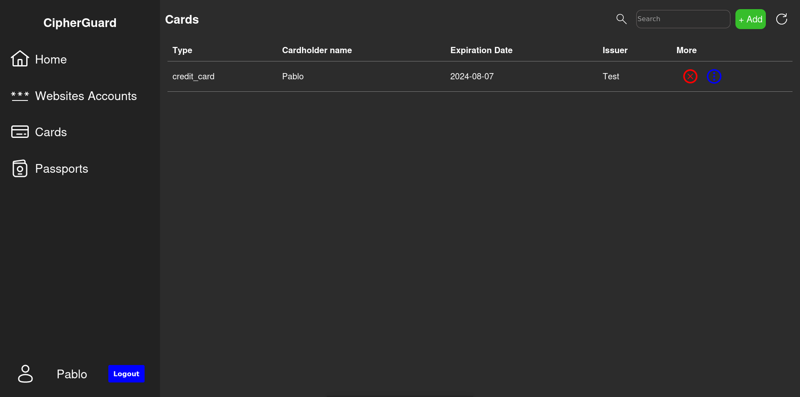
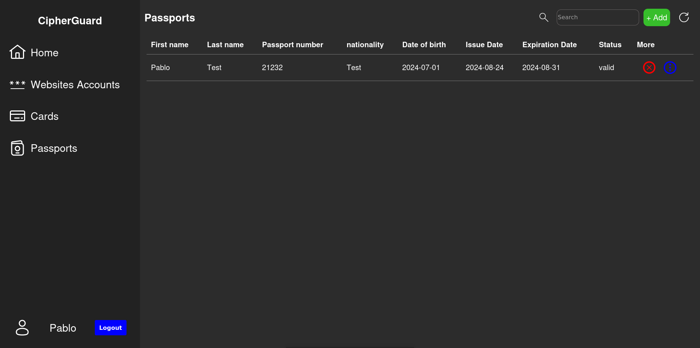

# CipherGuard Frontend

Welcome to **CipherGuard**, a web application for the secure management of passwords, credit cards, and passports. 

# Table of Contents 📚
- [Description 📝](#Description-)
  - [Author](#Author)
  - [Backend Repository](#Backend-Repository)
- [Screenshots 📸](#Screenshots-)
- [Tech Stack 🔧](#Tech-Stack-)
- [Installation 📦](#Installation-)

# Description 📝
CipherGuard is designed to help you store, organize, and access your sensitive information easily and quickly.

## Backend Repository
The backend for CipherGuard can be found at the following repository:
[CipherGuard_API](https://github.com/ismaelvr1999/CipherGuard_API)

## Author
- [@ismaelvr1999](https://www.github.com/ismaelvr1999)

# Screenshots 📸

### Login Screen


### Sign Up Screen


### Home Screen


### Websites Accounts Screen


### Cards Screen


### Passports Screen


# Tech Stack 🔧

This project utilizes the following technologies:
- **React** ⚛️: A library for building dynamic user interfaces.
- **JSX** 📝: A syntax extension for JavaScript that allows writing HTML elements in React.
- **CSS** 🎨: Stylesheets used to design and layout the application.
- **JavaScript (JS)** 💻: The programming language used to add interactivity and functionality.
- **Axios** 🌐: A promise-based HTTP client for making API requests.
- **react-router-dom** 🗺️: A library for handling routing and navigation in React applications.

# Installation 📦

To run this project locally, follow these steps:

1. **Clone the repository.**
   ```bash
   git clone https://github.com/ismaelvr1999/CipherGuard.git

2. **Install dependencies.**
   ```bash
   cd  CipherGuard
   npm install

3. **Set up environment variables.**
Create a .env file in the root of the project and add the following variables:
   ```env
    PORT=your_application_port
4. **Start the server.**
    ```bash
    npm start